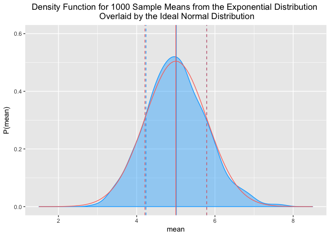
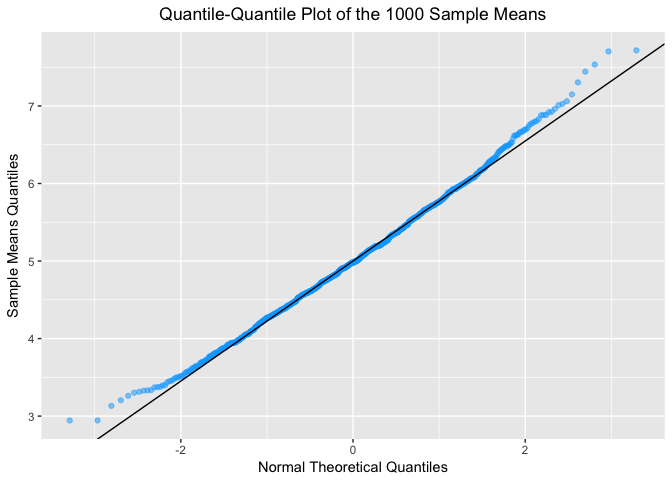

### Submission by Connor Lenio. Email: <cojamalo@gmail.com>

Completion Date: Apr XX, 2017

### Overview

In a few (2-3) sentences explain what is going to be reported on.

### Load packages

``` r
library(pander)
library(statsr)
library(ggplot2)
library(dplyr)
```

------------------------------------------------------------------------

### Simulations

Run the sampling simulation and derive relevant summary statistics from the data <br>

#### Set a seed for reproducibility of random sampling

A seed is set so this exact iteration of "random" sampling can be replicated in other R sessions:

``` r
set.seed(123)
```

<br>

#### Simulate 1000 samples of 40 values from the exponential distribution with λ = 0.2

The following code creates a data frame, `sim_samples` that contains the data for each sample of 40 values. The data frame is the mutated to calculate the mean, standard deviation, and variance for each of the 1000 samples.

``` r
#Initalize sim_samples
sim_samples <- NULL

#Use a for loop to take 1000 samples of 40 from the exponential distribution
for (i in 1 : 1000) {
    sample <- data.frame(sim = i, data = c(rexp(40, 0.2)))
    sim_samples <- rbind(sim_samples, sample)
}

#Mutate the simulated data to to calculate the mean, standard deviation, and variance for each of the 1000 samples
sim_samples <- sim_samples %>% group_by(sim) %>% summarize(x_bar_samp = mean(data), s_samp = sd(data), var_samp = s_samp^2)

#Display a portion of the data frame produced by the code - sim_samples
pandoc.table(head(sim_samples), caption = "Table 1-1 - The summary statistics for the first 6 simulations out of 1000 simulations of 40 samples from the exponential distribution ", justify = "center")
```

<table style="width:53%;">
<caption>Table 1-1 - The summary statistics for the first 6 simulations out of 1000 simulations of 40 samples from the exponential distribution With the data simulated, the report continues with camparisons between the samples and the theoretical exponential distribution.</caption>
<colgroup>
<col width="8%" />
<col width="18%" />
<col width="12%" />
<col width="13%" />
</colgroup>
<thead>
<tr class="header">
<th align="center">sim</th>
<th align="center">x_bar_samp</th>
<th align="center">s_samp</th>
<th align="center">var_samp</th>
</tr>
</thead>
<tbody>
<tr class="odd">
<td align="center">1</td>
<td align="center">4.811212</td>
<td align="center">4.173642</td>
<td align="center">17.41929</td>
</tr>
<tr class="even">
<td align="center">2</td>
<td align="center">5.360077</td>
<td align="center">6.207536</td>
<td align="center">38.53351</td>
</tr>
<tr class="odd">
<td align="center">3</td>
<td align="center">4.592871</td>
<td align="center">4.149878</td>
<td align="center">17.22149</td>
</tr>
<tr class="even">
<td align="center">4</td>
<td align="center">4.900051</td>
<td align="center">4.372193</td>
<td align="center">19.11607</td>
</tr>
<tr class="odd">
<td align="center">5</td>
<td align="center">5.516619</td>
<td align="center">5.124875</td>
<td align="center">26.26434</td>
</tr>
<tr class="even">
<td align="center">6</td>
<td align="center">5.612835</td>
<td align="center">4.961209</td>
<td align="center">24.61359</td>
</tr>
</tbody>
</table>

------------------------------------------------------------------------

### Sample Mean versus Theoretical Mean

<br>

#### 1. Plot the theoretical (population) distribution and mean

The assignment gives the necessary information to calculate μ, the theoretical mean of the exponential distribution of lamda 0.2, as mean = 1/λ. With μ calculated, the density function can be graphed with the mean marked by a vertical line:

``` r
#Calculate μ from λ
λ <- 0.2
μ <- 1/λ

#Plot the exponential density function with μ
ggplot(sim_samples, aes(x=sim)) + 
    stat_function(fun=dexp, args=list(rate = λ), geom = "path", color = "#F8766D") +
    geom_vline(xintercept = μ, color = "#F8766D", lty = 2) +
    geom_text(aes(x=6, label="μ = 5.00", y=0.10), colour="#F8766D", hjust = 0) +
    xlim(0,50) +
    ylim(0,0.21) +
    labs(title = "Exponential Density Function for λ = 0.2 ", x = "x", y = "P(x)") +
    theme(plot.title = element_text(hjust = 0.5))
```

 The Central Limit Theorem indicates that the the distribution of the means of multiple samples of independent random variables will be approximately normally distributed, regardless of the underlying distribution of the random variables. Thus, even though the underlying distribution is not normal, but exponential, one would expect the distribution of the sample means to be normal. The next step checks this expectation.

<br>

#### 2. Plot the distribution of sample means

The mean of the sample means is calculated as the sample estimate, `x_bar`. The distribution of the sample means is then plotted with `x_bar` marked.

``` r
#Calculate x_bar from the sample means
x_bar <- mean(sim_samples$x_bar_samp)

#Plot the distribution of means using ggplot
ggplot(sim_samples, aes(x = x_bar_samp)) + 
    geom_density(geom = "area", fill = "#00A9FF", alpha = 0.4,color = "#00A9FF") +
    geom_vline(xintercept = x_bar, color = "#00A9FF", lty = 2) +
    geom_text(aes(x=5.2, label=paste("x_bar =" , round(x_bar, digits = 2)), y=0.55), colour="#00A9FF", hjust = 0, text=element_text(size=12)) +
    ylim(0,0.6) +
    xlim (1.5,8.5) +
    labs(title = "Density Function for 1000 Sample Means from the Exponential Distribution ", x = "x_bar", y = "P(x_bar)") +
    theme(plot.title = element_text(hjust = 0.5))
```

    ## Warning: Ignoring unknown parameters: geom

    ## Warning: Ignoring unknown parameters: text

 As expected, this plot is normally distributed and is centered near to the theorhetical mean of the distribution that the samples were taken from. The estimate of the sample mean for this distribution is about 5.01. This is almsot exactly the same as the theorhetical mean, μ, which is calculated as exactly 5.00.

------------------------------------------------------------------------

### Sample Variance versus Theoretical Variance

#### 1. Calculate the theoretical (population) variance

The assignment gives the necessary information to calculate σ^2, the theoretical variance of the exponential distribution of lamda 0.2, as σ^2 = 1/λ.:

``` r
σ <- 1/λ
σ_2 <- σ^2
σ_2
```

    ## [1] 25

The theoretical variance is exactly 5^2, or 25.

<br>

#### 2. Plot the distribution of sample variance

The mean of the sample variances is calculated as the sample estimate, s^2\`. The distribution of the sample variances is then plotted with s^2 marked.

``` r
#Calculate the center of the distribution of sample variances
mean_var_samp <- mean(sim_samples$var_samp)

#Plot the distribution of sample variances
ggplot(sim_samples, aes(x = mean_var_samp)) + 
    geom_density(geom = "area", fill = "#00BE67", alpha = 0.4,color = "#00BE67") +
    geom_vline(xintercept = mean_var_samp, color = "#00BE67", lty = 2) +
    geom_text(aes(x=mean_var_samp+1, label=paste("s^2 = " , round(mean_var_samp, digits = 2)), y=0.08), colour="#00BE67", hjust = 0, text=element_text(size=12)) +
    ylim(0,0.1) +
    xlim (0,50) +
    labs(title = "Density Function for 1000 Sample Variances from the Exponential Distribution ", x = "s^2", y = "P(s^2)") +
    theme(plot.title = element_text(hjust = 0.5))
```

    ## Warning: Ignoring unknown parameters: geom

    ## Warning: Ignoring unknown parameters: text

 The sample variance estimate is about 24.84. This number is almost identical to the theoretical variance of 25. Since variance is the square of the standard deviation, any minor differences in standard deviation are magnified when computing variance. Thus, the small difference between 24.84 and 25 is acceptable.

<br>

------------------------------------------------------------------------

### Distribution

There are many ways to determine if a distribution is normal. In this section, two graphical methods are used to show the distribution of sample means is normally distrubuted.

<br>

In the first test for normaility, the sample distribution is plotted with the ideal normally distrubted sample population using what is known from the Central Limit Theorem. One can calculate the ideal normal distribution using μ and the equation for the standard error, SE = σ/sqrt(n):

``` r
#Calculate the standard error, SE, as well as the standard error of the sample means, s using n, the size of each sample
n <- 40
SE <- σ/sqrt(n)
s <- sd(sim_samples$x_bar_samp)

#Plot the sample distribution (blue) with the ideal normal distribution (pink) overlaid for comparison. Also, include the ideal and sample means and standard deviation as vertical lines
ggplot(sim_samples, aes(x = x_bar_samp)) + 
    geom_density(geom = "area", fill = "#00A9FF", alpha = 0.4,color = "#00A9FF") +
    geom_vline(xintercept = x_bar, color = "#00A9FF") +
    geom_vline(xintercept = x_bar-s, color = "#00A9FF", lty = 2) +
    geom_vline(xintercept = x_bar+s, color = "#00A9FF", lty = 2) +
    stat_function(fun=dnorm, args=list(mean=μ, sd=SE), geom = "path", fill = "#F8766D", color = "#F8766D") +
    geom_vline(xintercept = μ, color = "#F8766D") +
    geom_vline(xintercept = μ-SE, color = "#F8766D", lty = 2) +
    geom_vline(xintercept = μ+SE, color = "#F8766D", lty = 2) +
    ylim(0,0.6) +
    xlim (1.5,8.5) +
    labs(title = "Density Function for 1000 Sample Means from the Exponential Distribution \n Overlaid by the Ideal Normal Distribution", x = "mean", y = "P(mean)") +
    theme(plot.title = element_text(hjust = 0.5))
```

    ## Warning: Ignoring unknown parameters: geom

    ## Warning: Ignoring unknown parameters: fill

 The plot shows that the blue sample distribution almost exactly matches the pink, ideal normal distribution, giving strong evidence for the sample distribution's normality.

<br>

Further, a qunatile-quantile plot is used to check the sample mean distribution for normaility:

``` r
# Find the slope and intercept of the line that passes through the 1st and 3rd quartile of the normal q-q plot
y     <- quantile(sim_samples$x_bar_samp, c(0.25, 0.75)) # Find the 1st and 3rd quartiles
x     <- qnorm( c(0.25, 0.75))         # Find the matching normal values on the x-axis
slope <- diff(y) / diff(x)             # Compute the line slope
int   <- y[1] - slope * x[1]           # Compute the line intercept

#Plot the qunatile-quantile plot
ggplot(sim_samples, aes(sample = x_bar_samp)) + 
    geom_qq(color = "#00A9FF", alpha = 0.5) +
    geom_abline(intercept=int, slope=slope) +
    labs(title = "Quantile-Quantile Plot of the 1000 Sample Means", x = "Normal Theoretical Quantiles", y = "Sample Means Quantiles") +
    theme(plot.title = element_text(hjust = 0.5))
```

 The vast majority of points fall on the line, giving additional strong evidence that the distribution is normal.
